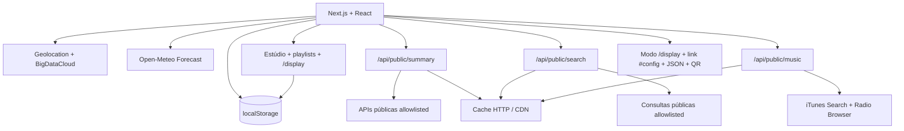

# LumaBoard

> Painéis ambientes local-first, sem conta obrigatória, sem chave de API e sem banco de dados.

[](https://nextjs.org/)
[](https://react.dev/)
[](https://www.typescriptlang.org/)
[](https://www.netlify.com/)
[](LICENSE)

O **LumaBoard 1.5** monta e exibe conteúdo para navegadores, e-readers, Raspberry Pi e futuras telas e-paper. Agenda, Pomodoro, playlists, fontes, pesquisas, localização escolhida e preferências ficam no `localStorage` do navegador. O servidor não mantém sessão e não grava SQLite, JSON ou banco.

## Princípio de custo

A arquitetura foi desenhada para não exigir assinatura de banco, autenticação, OAuth ou compra de chave de API:

- dados pessoais e configurações ficam no `localStorage`;
- respostas válidas das APIs também ficam em cache local;
- as rotas do Next.js funcionam como Netlify Functions **sem estado**;
- as Functions aceitam apenas provedores definidos no código;
- consultas mais pesadas são feitas somente quando o usuário envia o formulário;
- respostas públicas recebem `Cache-Control` para aproveitar a CDN;
- se uma fonte falhar, as outras continuam sendo exibidas e o navegador usa o último cache válido.

Isso evita um serviço persistente pago, mas não torna hospedagem e APIs ilimitadas. O plano gratuito do Netlify e cada provedor possuem cotas e termos próprios. Aumente o intervalo de atualização se o projeto receber muito tráfego.

## Executar localmente

Requer Node.js 22.13 ou superior.

```bash
npm install
npm run dev
```

Abra `http://localhost:3000`.

Validação:

```bash
npm test
npm run lint
npm run build
```

## Funcionalidades reais

- localização pela máquina, por IP aproximado ou por cidade pesquisada;
- clima atual, previsão horária e alerta de chuva;
- agenda local com lembretes e tarefas de ocorrência única, diária, semanal, mensal ou anual;
- conclusão por ocorrência e notificações do navegador enquanto o LumaBoard estiver aberto;
- Pomodoro funcional, tarefa atual e duração configurável;
- qualidade do ar, câmbio, feriados, carrossel de notícias de tecnologia, Selic, IPCA e dados do IBGE;
- carrossel de notícias de anime e lista de títulos atualmente em exibição;
- terremotos mundiais e distância do evento mais próximo;
- altitude, vazão de rios, condição marítima e horários solares;
- livro e artigo em destaque, além da programação de TV disponível;
- pesquisa sob demanda de cidades, livros, Wikipédia, séries, animes e alimentos;
- Biblioteca para ativar ou ocultar fontes opcionais;
- Estúdio Visual com drag-and-drop, redimensionamento, colunas, fontes, transparência, bordas e múltiplos layouts;
- playlists reais por dias e horários, duração de tela, transições, aleatoriedade e pausa por interação;
- modo display em `/display`, tela cheia, cache offline, Wake Lock quando suportado e cursor automático;
- compartilhamento por link, QR code e arquivo JSON, sem conta ou banco;
- busca global, atalhos de teclado, diagnóstico das APIs e limpeza seletiva de cache;
- notícias marcadas como lidas, salvas, filtradas por fonte, por imagem e com velocidade configurável;
- sugestões musicais por gênero, prévias de 30 segundos, rádios ao vivo e favoritos locais;
- backup e restauração em JSON de todas as chaves gerenciadas;
- tema claro e noturno;
- atualização configurável entre 5 e 60 minutos;
- botão externo para pesquisar o gênero ou faixa no Spotify, sem usar a Web API do Spotify.

## Agenda, tarefas e lembretes

Cada item da agenda pode ser criado como **Lembrete** ou **Tarefa** e configurado como:

- uma vez;
- todos os dias;
- toda semana, no mesmo dia da semana;
- todo mês, no mesmo dia do mês;
- todo ano, no mesmo mês e dia.

Para repetir no dia 26, escolha uma data cujo dia seja 26 e selecione **Todo mês**. Para outro assunto no dia 10, crie um segundo item mensal com o dia 10. A conclusão é registrada por ocorrência: uma tarefa mensal concluída em julho volta a aparecer em agosto. Uma tarefa de ocorrência única permanece no histórico local e pode ser reaberta ou excluída.

O botão **Ativar alertas** solicita permissão da Notifications API. Como o projeto não usa push, servidor persistente ou conta, o navegador só consegue disparar o alerta enquanto o LumaBoard estiver aberto. Se a página estiver fechada ou o dispositivo suspenso, não há garantia de notificação em segundo plano.

## APIs e serviços usados

Todas as integrações abaixo funcionam sem chave de acesso na configuração atual. Elas continuam sujeitas aos termos, limites, disponibilidade e atribuições de seus mantenedores.

### Navegador

| Recurso | Serviço | Uso no projeto | Persistência |
| --- | --- | --- | --- |
| Coordenadas da máquina | [Geolocation API](https://developer.mozilla.org/docs/Web/API/Geolocation_API) | localização com permissão do navegador | `lumaboard-location-v1` |
| Localização aproximada/reversa | [BigDataCloud Reverse Geocode Client](https://www.bigdatacloud.com/free-api/free-reverse-geocode-to-city-api) | cidade, estado e país quando necessário | `lumaboard-location-v1` |
| Clima e alerta de chuva | [Open-Meteo Forecast](https://open-meteo.com/en/docs) | condição atual, mínima, máxima e precipitação horária | `lumaboard-weather-v1` |

### Resumo automático: `/api/public/summary`

| Cartão | API pública | Dados utilizados |
| --- | --- | --- |
| Qualidade do ar | [Open-Meteo Air Quality / CAMS](https://open-meteo.com/en/docs/air-quality-api) | AQI europeu e PM2.5 |
| Câmbio | [Frankfurter](https://frankfurter.dev/) | USD/BRL e EUR/BRL |
| Feriados | [BrasilAPI](https://brasilapi.com.br/docs) | próximo feriado nacional |
| Notícias de tecnologia | [Hacker News API](https://github.com/HackerNews/API) + [DEV Community API](https://developers.forem.com/api/v0) | carrossel com histórias em destaque, imagens quando disponíveis e abertura da fonte original |
| Notícias de anime | [Anime News Network RSS](https://www.animenewsnetwork.com/all/rss.xml) | carrossel de notícias da indústria de anime e mangá |
| Animes em exibição | [Jikan API v4](https://docs.api.jikan.moe/) | títulos atualmente em exibição, notas e links para detalhes |
| Economia | [Banco Central do Brasil — SGS](https://dadosabertos.bcb.gov.br/) | Selic, série 1178, e IPCA, série 433 |
| Município | [IBGE Localidades](https://servicodados.ibge.gov.br/api/docs/localidades) | código, município, UF e regiões |
| População | [IBGE Agregados v3](https://servicodados.ibge.gov.br/api/docs/agregados?versao=3) | estimativa populacional do município |
| Terremotos | [USGS Earthquake Hazards Program](https://earthquake.usgs.gov/earthquakes/feed/v1.0/geojson.php) | eventos das últimas 24 horas |
| Altitude | [Open-Meteo Elevation](https://open-meteo.com/en/docs/elevation-api) | elevação das coordenadas |
| Rios | [Open-Meteo Flood](https://open-meteo.com/en/docs/flood-api) | vazão modelada e máxima prevista |
| Mar | [Open-Meteo Marine](https://open-meteo.com/en/docs/marine-weather-api) | ondas, temperatura do mar e corrente |
| Sol e Lua | [Sunrise-Sunset.org API v2](https://sunrise-sunset.org/api) | nascer/pôr do sol e duração do dia |
| Livro | [Open Library](https://openlibrary.org/developers/api) | sugestão rotativa de livro |
| Artigo | [Wikimedia REST API](https://www.mediawiki.org/wiki/Wikimedia_REST_API) | resultado rotativo da Wikipédia em português |
| TV e streaming | [TVmaze API](https://www.tvmaze.com/api) | programação disponível para o Brasil |

### Consultas sob demanda: `/api/public/search`

| Tipo | Fontes | Comportamento |
| --- | --- | --- |
| `location` | [Open-Meteo Geocoding](https://open-meteo.com/en/docs/geocoding-api), com [OpenStreetMap Nominatim](https://nominatim.org/release-docs/latest/api/Search/) apenas como fallback | pesquisa somente ao enviar; permite aplicar a cidade ao painel |
| `book` | [Open Library](https://openlibrary.org/developers/api) | busca por título, autor ou assunto |
| `wikipedia` | [Wikimedia REST API](https://www.mediawiki.org/wiki/Wikimedia_REST_API) | busca de páginas em português |
| `tv` | [TVmaze API](https://www.tvmaze.com/api) | busca de séries e metadados |
| `anime` | [Jikan API v4](https://docs.api.jikan.moe/) | busca de anime, sinopse, nota, episódios e status |
| `food` | [Open Food Facts API v3.6](https://openfoodfacts.github.io/documentation/docs/Product-Opener/v3/products/get-api-v3-product-code/) | leitura de produto por código de barras |

### Música por gênero: `/api/public/music`

| Recurso | API pública | Uso |
| --- | --- | --- |
| Sugestões e prévias | [Apple iTunes Search API](https://developer.apple.com/library/archive/documentation/AudioVideo/Conceptual/iTuneSearchAPI/) | busca faixas do gênero escolhido, metadados, capa e prévia de aproximadamente 30 segundos |
| Rádios ao vivo | [Radio Browser](https://www.radio-browser.info/) | estações públicas por gênero, codec e bitrate |
| Abrir no Spotify | busca pública do site Spotify | somente um link externo de pesquisa; não há chamada à Web API |
| QR code | [QRServer / goQR](https://goqr.me/api/) | gera o QR do link compartilhável somente quando solicitado |

```http
GET /api/public/music?genre=rock
GET /api/public/music?genre=lofi
GET /api/public/music?genre=anime
```

A rota possui uma lista fechada de gêneros, normaliza as respostas e aplica cache HTTP. A Web API do Spotify **não é usada**, porque exige token de autorização mesmo para leitura. Assim, o projeto continua sem cadastro, client secret ou chave de acesso.

O catálogo [public-apis/public-apis](https://github.com/public-apis/public-apis) foi usado como referência de descoberta, mas não é dependência de execução. Cada integração é validada diretamente com a documentação e os termos do provedor.

As notícias do Anime News Network podem ser publicadas em inglês, pois o projeto preserva o título original e sempre abre a fonte oficial em uma nova aba. O Jikan é usado apenas para leitura e recebe cache para reduzir chamadas.

O Nominatim só é consultado quando o Open-Meteo Geocoding não encontra resultados. A busca acontece apenas após o envio do formulário, passa por cache, identifica a aplicação e exibe atribuição ao OpenStreetMap; não existe autocomplete a cada tecla. O Open Food Facts usa a API v3.6 somente para leitura, com `User-Agent`, e a Open Library também é usada em baixo volume e por ação do usuário.

## Functions sem estado

### Resumo

```http
GET /api/public/summary?lat=-23.5505&lon=-46.6333&city=São%20Paulo&state=SP&tz=America/Sao_Paulo
```

A rota executa as fontes em paralelo com `Promise.allSettled`. Uma falha não invalida todo o resumo. O JSON inclui `warnings` com os provedores temporariamente indisponíveis. Notícias de tecnologia combinam Hacker News e DEV Community; notícias de anime usam RSS do Anime News Network, e os títulos em exibição vêm do Jikan.

### Música

```http
GET /api/public/music?genre=electronic
```

Retorna sugestões com prévia e rádios por gênero. Não grava histórico no servidor; o gênero, os resultados e favoritos são armazenados no navegador.

### Pesquisa

```http
GET /api/public/search?type=location&q=Curitiba
GET /api/public/search?type=book&q=design
GET /api/public/search?type=wikipedia&q=computação
GET /api/public/search?type=tv&q=dark
GET /api/public/search?type=anime&q=one%20piece
GET /api/public/search?type=food&q=7891000100103
```

Os tipos são uma allowlist. A rota não aceita URL externa arbitrária e, portanto, não funciona como proxy aberto.

## Cache e `localStorage`

| Chave | Conteúdo |
| --- | --- |
| `lumaboard-agenda` | lembretes, tarefas, recorrências e conclusões por data |
| `lumaboard-agenda-notifications` | ocorrências já notificadas para evitar alertas duplicados |
| `lumaboard-focus` | projeto, tarefa e estado do Pomodoro |
| `lumaboard-public-data-v2` | último resumo válido das APIs públicas |
| `lumaboard-public-explorer-v1` | últimas consultas e resultados sob demanda |
| `lumaboard-refresh-minutes` | intervalo automático das fontes |
| `lumaboard-location-v1` | última localização automática ou manual |
| `lumaboard-weather-v1` | último clima válido |
| `lumaboard-studio` | rascunho do Estúdio |
| `lumaboard-playlist` | playlist local |
| `lumaboard-devices` | perfis locais de display |
| `lumaboard-plugins` | fontes opcionais visíveis |
| `lumaboard-rules` | alerta de chuva e histórico |
| `lumaboard-dashboard-v2` | layouts, widgets, propriedades, playlists e configurações do modo display |
| `lumaboard-music-v1` | gênero, sugestões, rádios e favoritos musicais |
| `lumaboard-news-preferences-v1` | fonte, velocidade, filtro por imagem e modo somente salvas |
| `lumaboard-news-state-v1` | notícias lidas e salvas |

A versão 1.5 preserva os dados da versão 1.4 e migra a agenda simples das versões anteriores para lembretes únicos e reconhece as seleções padrão das versões 1.2 e 1.3, ativando a nova fonte de anime sem apagar os demais dados. A chave antiga `lumaboard-public-data-v1` permanece na lista de backup para permitir migração e pode ser removida manualmente depois.

O `localStorage` pertence ao navegador e à origem do site. Limpar os dados do site apaga as configurações. Navegadores diferentes não sincronizam automaticamente; use **Automação → Exportar JSON** para transportar os dados.

## Estúdio Visual, playlists e modo display

O Estúdio permite:

- criar, renomear, duplicar e excluir layouts;
- arrastar widgets para mudar a ordem;
- ativar, ocultar e redimensionar cada bloco;
- ajustar colunas, espaçamento, fundo, opacidade, escala de fonte, cabeçalho e borda;
- visualizar em desktop, tablet, celular e e-paper;
- importar ou exportar toda a configuração em JSON;
- copiar um link completo ou gerar QR code.

A área **Playlists** associa layouts a dias e janelas de horário. O modo `/display` resolve a programação localmente e oferece:

- anterior, próximo e pausa;
- transição suave, deslizante ou sem animação;
- tela cheia por ação do usuário;
- cursor oculto após inatividade;
- Screen Wake Lock quando o navegador oferecer suporte;
- indicador online/offline e uso do último cache;
- retorno automático à programação depois da pausa por interação.

Atalhos principais:

| Atalho | Ação |
| --- | --- |
| `Ctrl/Cmd + K` ou `/` | abrir busca global |
| `D` | abrir modo display |
| `R` | atualizar clima e dados públicos |
| `1` a `8` | abrir áreas principais |

## Publicar no Netlify

| Campo | Valor |
| --- | --- |
| Build command | `npm run build` |
| Publish directory | `.next` |
| Node.js | `22.13.0` ou superior |
| Variáveis de ambiente | nenhuma obrigatória |
| Banco de dados | nenhum |

O adaptador do Netlify para Next.js publica os Route Handlers como Functions. Não configure SQLite, arquivo JSON gravável, Netlify Database ou serviço externo para esta versão.

O plano Free atual do Netlify é gratuito e possui limite mensal rígido. Se a cota acabar, o projeto pode ser pausado até o próximo ciclo. Use o cache de 15 minutos, mantenha as pesquisas sob demanda e acompanhe **Usage & billing** no painel do Netlify.

## Compartilhar um display sem banco

Use **Gerar link do display**. O LumaBoard cria:

```text
/display#config=...
```

O fragmento após `#` é processado no navegador e não é enviado ao servidor. Ele contém layouts, widgets e programação do display; não contém a agenda pessoal, favoritos ou caches. O aparelho que abrir o link consulta seu próprio clima e as APIs públicas. Não coloque senhas, tokens ou informações sensíveis no nome de layouts ou widgets.

O Estúdio também exporta e importa um arquivo JSON. O QR code é opcional: quando exibido, o link é enviado ao serviço QRServer somente para gerar a imagem do código.

Sincronização contínua, revogação remota, telemetria real e envio de frames a um ESP32 exigiriam estado compartilhado e não fazem parte desta arquitetura gratuita.

## Arquitetura



| Parte | Arquivo | Responsabilidade |
| --- | --- | --- |
| Shell | `app/LumaBoardApp.tsx` | navegação, prévia e cartões públicos |
| Dados locais | `app/local-widgets.ts` | agenda e temporizador persistentes |
| Clima | `app/weather.ts` | localização, previsão, local manual e cache |
| Resumo público | `app/public-data.ts` | cliente, validação, atualização e fallback local |
| Pesquisas | `app/public-explorer.tsx` | consultas sob demanda e aplicação de local |
| Function de resumo | `app/api/public/summary/route.ts` | agregação paralela sem estado |
| Function de pesquisa | `app/api/public/search/route.ts` | pesquisa allowlisted sem estado |
| Módulos | `app/modules.tsx` | displays, Biblioteca, automação e módulos legados |
| Estúdio e playlists | `app/studio-v2.tsx` | editor visual, layouts, programação, importação e compartilhamento |
| Configuração visual | `app/dashboard-config.ts` | tipos, validação, persistência, programação e link compartilhável |
| Renderizador | `app/dashboard-renderer.tsx` | widgets reais reutilizados no Estúdio e no display |
| Display | `app/display/` | rota independente, fullscreen, Wake Lock, offline e transições |
| Música | `app/music-module.tsx` e `app/api/public/music/route.ts` | gêneros, prévias, rádios e favoritos |
| Diagnóstico | `app/diagnostics-module.tsx` | status, provedores, tamanho local e limpeza seletiva |
| Backup | `app/storage.ts` | chaves gerenciadas, migração, exportação e importação |
| Visual | `app/globals.css` | temas e responsividade |

## Privacidade

Nenhuma conta, senha ou chave de API é solicitada. Coordenadas, cidade, gêneros e termos pesquisados são enviados somente aos serviços necessários para responder à ação do usuário. O código da Function não grava essas requisições. Provedores externos e a plataforma de hospedagem podem manter logs conforme suas próprias políticas.

Para apagar os dados locais, limpe os dados do site no navegador. Para transportar as configurações, exporte o backup JSON.

## Licença e atribuições

O LumaBoard é distribuído sob a [Licença MIT](LICENSE). Dados e marcas externas permanecem sujeitos às licenças dos respectivos provedores. Preserve os links de atribuição exibidos na interface, especialmente OpenStreetMap, Open-Meteo/CAMS/DWD, Sunrise-Sunset.org, Open Food Facts, Open Library, Wikimedia, TVmaze, Anime News Network, Jikan, DEV Community, Apple iTunes Search, Radio Browser e QRServer/goQR.
