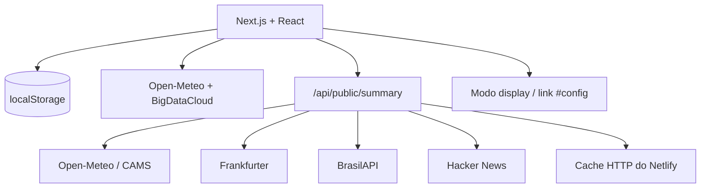

# LumaBoard

> Painéis ambientes local-first, sem conta, sem chave de API e prontos para o plano gratuito do Netlify.

[](https://nextjs.org/)
[](https://react.dev/)
[](https://www.typescriptlang.org/)
[](https://www.netlify.com/)
[](LICENSE)

O **LumaBoard** monta e exibe conteúdo para navegadores, e-readers, Raspberry Pi e futuras telas e-paper. A aplicação não exige cadastro: agenda, foco, playlists, fontes e preferências ficam no `localStorage`.

## Executar localmente

Requer Node.js 22.13 ou superior.

```bash
npm install
npm run dev
```

Abra `http://localhost:3000`.

Validação:

```bash
npm test
npm run lint
npm run build
```

## Dados reais sem chave

| Recurso | Fonte | Onde roda | Persistência |
| --- | --- | --- | --- |
| Localização | Geolocation API + BigDataCloud | navegador | cache local |
| Clima e chuva | Open-Meteo | navegador | cache local |
| Qualidade do ar | Open-Meteo / CAMS | Function sem estado | cache HTTP + local |
| Dólar e euro | Frankfurter | Function sem estado | cache HTTP + local |
| Feriados nacionais | BrasilAPI | Function sem estado | cache HTTP + local |
| Notícias de tecnologia | Hacker News API | Function sem estado | cache HTTP + local |
| Agenda | formulário do LumaBoard | navegador | `localStorage` |
| Pomodoro e tarefa | temporizador do LumaBoard | navegador | `localStorage` |

A rota `GET /api/public/summary?lat={latitude}&lon={longitude}` agrega apenas provedores fixos. Ela não aceita uma URL arbitrária e não funciona como proxy aberto.

## Netlify gratuito e Functions

O projeto pode ser publicado no plano Free do Netlify sem assinatura paga. O adaptador de Next.js transforma a rota em uma Netlify Function automaticamente.

| Campo | Valor |
| --- | --- |
| Build command | `npm run build` |
| Publish directory | `.next` |
| Node.js | `22.13.0` |

A Function é **sem estado**: ela consulta APIs públicas, normaliza o JSON e devolve cabeçalhos de cache. Não grava SQLite, arquivo JSON ou banco de dados.

O plano gratuito possui limites mensais rígidos. Quando a cota é atingida, o projeto pode ser pausado até o próximo ciclo; ele não gera cobrança automática. Consulte o painel de uso do Netlify antes de aumentar a frequência de atualização.

## Funcionalidades

- clima local, previsão e alerta de chuva;
- qualidade do ar, câmbio, feriado e notícias reais com intervalo configurável;
- agenda local com inclusão e exclusão de eventos;
- Pomodoro persistente com iniciar, pausar e reiniciar;
- prévia e-paper em `800 × 480` alimentada pela agenda e pelo foco;
- modo display em tela cheia;
- link de display com configuração no fragmento `#config`;
- Estúdio, playlists, perfis de display e fontes visíveis salvos localmente;
- backup e restauração JSON incluindo agenda, foco e fontes ativadas;
- alerta de chuva local avaliado enquanto a página está aberta;
- temas claro e noturno.

## Compartilhar um display sem backend persistente

Use **Gerar link do display**. O LumaBoard codifica o próximo compromisso e a sessão de foco no fragmento da URL:

```text
/?display=1#config=...
```

O fragmento após `#` é processado pelo navegador e não é enviado ao Netlify. O aparelho que abrir o link resolve sua própria localização e busca os dados públicos.

Isso substitui o pareamento fictício por código. Sincronização contínua entre dois aparelhos ainda exigiria armazenamento compartilhado, que não faz parte desta versão.

## Arquitetura



| Parte | Arquivo | Responsabilidade |
| --- | --- | --- |
| Shell | `app/LumaBoardApp.tsx` | navegação, prévia, agenda, foco e dados públicos |
| Dados locais | `app/local-widgets.ts` | eventos e temporizador persistentes |
| Dados públicos | `app/public-data.ts` | cliente, cache e estado das APIs |
| Function | `app/api/public/summary/route.ts` | agregação sem estado e allowlist de provedores |
| Clima | `app/weather.ts` | localização, previsão e cache |
| Módulos | `app/modules.tsx` | Estúdio, playlists, displays, biblioteca e automação |
| Backup | `app/storage.ts` | chaves gerenciadas, migração, exportação e importação |
| Visual | `app/globals.css` | temas e responsividade |

## Privacidade

Nenhuma conta, senha ou chave de API é solicitada. As coordenadas são enviadas aos serviços necessários para obter clima e qualidade do ar. A Function não persiste requisições no código da aplicação.

Principais chaves locais:

| Chave | Conteúdo |
| --- | --- |
| `lumaboard-agenda` | compromissos locais |
| `lumaboard-focus` | projeto, tarefa e estado do temporizador |
| `lumaboard-public-data-v1` | último resumo válido das APIs públicas |
| `lumaboard-refresh-minutes` | intervalo automático das APIs públicas |
| `lumaboard-location-v1` | última localização resolvida |
| `lumaboard-weather-v1` | último clima válido |
| `lumaboard-studio` | rascunho do Estúdio |
| `lumaboard-playlist` | playlist local |
| `lumaboard-devices` | perfis locais de display |
| `lumaboard-plugins` | fontes ativadas |
| `lumaboard-rules` | regra de chuva e histórico |

Para apagar tudo, limpe os dados do site no navegador. Para transportar as configurações, use **Automação → Exportar JSON**.

## Limitações intencionais

Sem banco ou serviço de autenticação, o projeto não oferece sincronização automática entre navegadores, telemetria real de hardware, armazenamento de segredos, filas de renderização ou controle remoto de ESP32. O protocolo atual é documentado em [`docs/PROTOCOLO-DISPOSITIVO.md`](docs/PROTOCOLO-DISPOSITIVO.md).

## Licença

Distribuído sob a [Licença MIT](LICENSE). APIs externas permanecem sujeitas aos próprios termos, limites e requisitos de atribuição.
