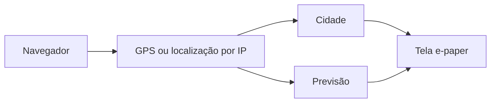
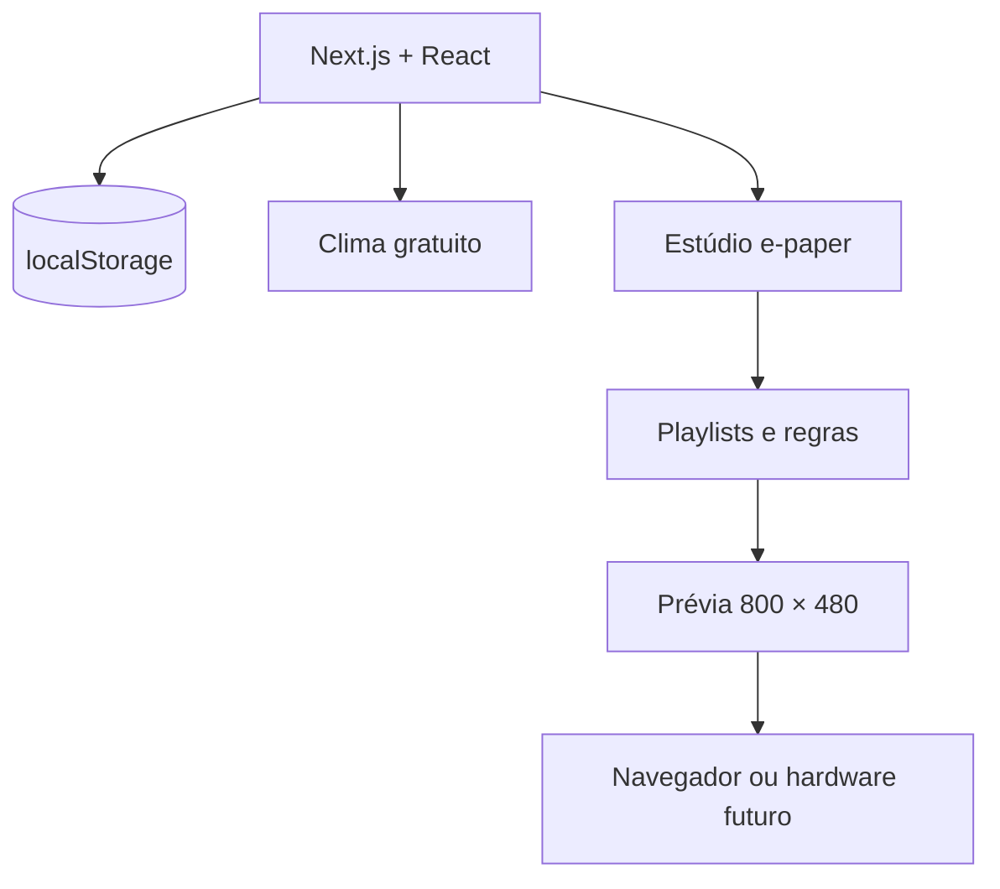

# LumaBoard

> Painéis ambientes, sem distrações — local-first, responsivo e pronto para Netlify.

[](https://nextjs.org/)
[](https://react.dev/)
[](https://www.typescriptlang.org/)
[](https://www.netlify.com/)
[](LICENSE)

[](https://app.netlify.com/start/deploy?repository=https://github.com/RaphaelTW/LumaBoard)

O **LumaBoard** é uma central web para montar, programar e visualizar conteúdo em displays e-paper, ESP32, e-readers, Raspberry Pi ou qualquer navegador. A versão atual funciona totalmente no frontend, salva configurações no navegador e não exige cadastro.

## Navegação rápida

- [Executar localmente](#executar-localmente)
- [Clima e localização](#clima-e-localização)
- [Publicar no Netlify](#publicar-no-netlify)
- [Funcionalidades](#funcionalidades)
- [Arquitetura](#arquitetura)
- [Privacidade](#privacidade)
- [Licença](#licença)

## Executar localmente

<details open>
<summary><strong>Windows, macOS ou Linux</strong></summary>

Requer [Node.js 22.13 ou superior](https://nodejs.org/).

```bash
npm install
npm run dev
```

Abra [http://localhost:3000](http://localhost:3000).

</details>

<details>
<summary><strong>Validar a versão de produção</strong></summary>

```bash
npm test
npm run start
```

O comando `npm test` executa lint e build de produção.

</details>

## Clima e localização

O cartão e-paper não usa mais temperatura fixa. Data, cidade, temperatura, mínima, máxima e condição são montadas em tempo real usando a mesma localização.



| Etapa | Serviço | Custo nesta versão |
| --- | --- | --- |
| Coordenadas | Geolocation API do navegador | Gratuito |
| Cidade | BigDataCloud client-side reverse geocoding | Gratuito, sujeito a uso justo |
| Temperatura e previsão | Open-Meteo | Gratuito para uso não comercial, sem chave |
| Cache | `localStorage` | Local e gratuito |

O navegador solicita permissão de localização. Se ela for negada, o sistema tenta uma localização aproximada por IP; se isso também falhar, usa São Paulo como fallback explícito. O clima é atualizado a cada 15 minutos e o cache evita deixar a tela vazia quando a rede oscila.

> [!IMPORTANT]
> O endpoint público gratuito do Open-Meteo é permitido para uso **não comercial** e exige atribuição. Antes de monetizar o produto, use um plano comercial compatível ou hospede uma fonte meteorológica própria. Consulte os [termos do Open-Meteo](https://open-meteo.com/en/terms) e a política de uso do [BigDataCloud](https://www.bigdatacloud.com/free-api/free-reverse-geocode-to-city-api).

## Publicar no Netlify

1. Envie o projeto para o GitHub.
2. No Netlify, escolha **Add new project → Import an existing project**.
3. Selecione `RaphaelTW/LumaBoard`.
4. Confirme as configurações detectadas.

| Campo | Valor |
| --- | --- |
| Build command | `npm run build` |
| Publish directory | `.next` |
| Node.js | `22.13.0` |

Esses valores já estão definidos em [`netlify.toml`](netlify.toml). O Netlify detecta o Next.js automaticamente; não é necessário instalar plugin legado.

## Funcionalidades

- [x] Tema **Editorial e-ink**
- [x] Tema **Ambient Night Console** com preferência salva
- [x] Data real no fuso da localização
- [x] Cidade e clima obtidos da mesma coordenada
- [x] Temperatura atual, mínima, máxima e condição meteorológica
- [x] Cache climático e atualização automática a cada 15 minutos
- [x] Prévia responsiva em `800 × 480`
- [x] Simulação de refresh e-paper
- [x] Estúdio visual com blocos, layouts e paletas
- [x] Playlists reordenáveis e simulação de horário
- [x] Gestão demonstrativa de displays BYOD
- [x] Estimativa interativa de bateria
- [x] Modo display em tela cheia
- [x] Biblioteca pesquisável de plugins
- [x] Automações locais
- [x] Backup e restauração em JSON
- [x] Layout responsivo e navegação por teclado
- [x] Deploy independente no Netlify

<details>
<summary><strong>O que ainda depende de backend</strong></summary>

- autenticação e contas de usuário;
- sincronização entre navegadores;
- comunicação real com ESP32, Kindle e outros dispositivos;
- armazenamento seguro de tokens;
- pagamentos e planos;
- renderização de imagens para hardware e filas de atualização.

O contrato sugerido para hardware está documentado em [`docs/PROTOCOLO-DISPOSITIVO.md`](docs/PROTOCOLO-DISPOSITIVO.md).

</details>

## Arquitetura



| Parte | Arquivo | Responsabilidade |
| --- | --- | --- |
| Entrada | `app/page.tsx` | Monta a aplicação |
| Shell | `app/LumaBoardApp.tsx` | Temas, navegação, prévia e modais |
| Clima | `app/weather.ts` | Localização, previsão, cache e fallbacks |
| Módulos | `app/modules.tsx` | Estúdio, playlists, dispositivos e automação |
| Visual | `app/globals.css` | Temas e responsividade |
| Metadados | `app/layout.tsx` | SEO, idioma e manifesto PWA |
| Deploy | `netlify.toml` | Build, Node.js e cabeçalhos do Netlify |

## Comandos

| Comando | Ação |
| --- | --- |
| `npm run dev` | inicia o ambiente local |
| `npm run lint` | valida o código |
| `npm run build` | gera o build de produção |
| `npm test` | executa lint e build |
| `npm run start` | serve o build de produção |

## Privacidade

As preferências, playlists, automações e o último clima ficam no `localStorage`. As coordenadas são enviadas diretamente do navegador aos serviços de localização e clima; o LumaBoard não possui servidor nesta versão.

| Chave | Conteúdo |
| --- | --- |
| `lumaboard-theme` | tema escolhido |
| `lumaboard-location-v1` | última localização resolvida |
| `lumaboard-weather-v1` | último clima válido |
| `lumaboard-studio` | rascunho do Estúdio |
| `lumaboard-playlist` | ordem e estado das telas |
| `lumaboard-plugins` | plugins instalados |
| `lumaboard-rules` | automações |

Para apagar tudo, limpe os dados do site no navegador. Para transportar as configurações, use **Automação → Exportar JSON**.

## Autoria

Criado e mantido por [RaphaelTW](https://github.com/RaphaelTW).

## Licença

Distribuído sob a [Licença MIT](LICENSE). Bibliotecas e APIs externas permanecem sujeitas às respectivas licenças e termos de uso.
