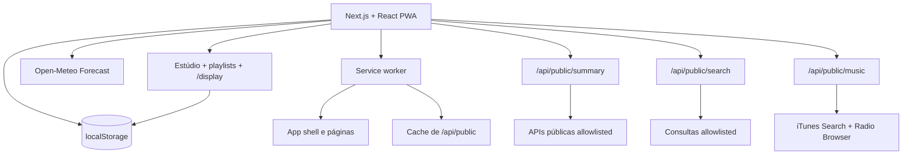

# LumaBoard

> Painéis ambientes local-first, instaláveis e resilientes, sem conta obrigatória, sem chave de API e sem banco de dados.

[](https://nextjs.org/)
[](https://react.dev/)
[](https://www.typescriptlang.org/)
[](https://web.dev/learn/pwa/)
[](https://www.netlify.com/)
[](LICENSE)

O **LumaBoard 1.6 — PWA & Offline Experience** cria e exibe painéis para computadores, celulares, tablets, televisões, e-readers, Raspberry Pi e futuras telas e-paper. Agenda, tarefas, Pomodoro, layouts, temas, preferências, favoritos e os últimos dados públicos ficam no `localStorage` do navegador. O servidor apenas normaliza APIs públicas por meio de Functions sem estado.

Consulte o histórico completo em [CHANGELOG.md](CHANGELOG.md). O mesmo changelog também aparece na área **Experiência** do aplicativo.

## Destaques da versão 1.6.0

- PWA instalável com service worker próprio e atualização controlada pelo usuário;
- app shell, páginas principais, ícones e arquivos estáticos disponíveis offline;
- tela offline personalizada e fallback para os últimos dados públicos salvos;
- aviso de nova versão, botão **Atualizar agora** e backup temporário antes do recarregamento;
- restauração da última área aberta e opção de iniciar diretamente em `/display`;
- sincronização das APIs quando a conexão retorna;
- Central de Notificações inteiramente local;
- agenda mensal e semanal com arrastar e soltar, recorrência avançada e `.ics`;
- temas Papel, Noturno, OLED e E-paper, além de temas personalizados por layout;
- galeria com dez modelos locais;
- validação de backup, limites de tamanho, recuperação de dados corrompidos e migração automática;
- tratamento global de erros e monitor básico de desempenho.

## Princípio de custo e privacidade

A arquitetura foi desenhada para funcionar sem autenticação, OAuth, assinatura de banco ou compra de chave de API:

- dados pessoais e configurações permanecem no navegador;
- respostas válidas das APIs ficam em cache no `localStorage` e no service worker;
- as rotas do Next.js funcionam como Netlify Functions **sem estado**;
- nenhuma Function grava SQLite, arquivo JSON ou sessão persistente;
- as Functions aceitam somente provedores definidos no código;
- pesquisas mais pesadas são executadas sob demanda;
- respostas públicas usam cache HTTP/CDN;
- a falha de uma fonte não invalida as demais;
- não há telemetria própria, conta de usuário ou sincronização silenciosa entre aparelhos.

O plano gratuito da hospedagem e cada API continuam sujeitos a limites próprios. O cache reduz chamadas, mas não transforma os serviços em recursos ilimitados.

## Executar localmente

Requer Node.js 22.13 ou superior.

```bash
npm install
npm run dev
```

Abra `http://localhost:3000`.

Validação recomendada:

```bash
npm test
npm run lint
npm run build
```

## PWA e experiência offline

O arquivo `public/sw.js` implementa o service worker sem dependência adicional. Ele mantém caches separados para:

- app shell e arquivos estáticos;
- páginas principais (`/`, `/display` e `/offline`);
- respostas das rotas `/api/public/*`;
- ícones e manifesto de instalação.

Navegações e APIs usam estratégia **network first**, com fallback para cache. Arquivos estáticos usam **stale while revalidate**. A aplicação não aplica `skipWaiting` automaticamente: uma atualização fica aguardando até o usuário escolher **Atualizar agora**, evitando a troca de código no meio de uma edição.

Antes da atualização, o LumaBoard cria:

- um snapshot temporário das chaves `lumaboard-*`;
- um backup validado na sessão;
- uma opção de recuperação na área **Experiência** após o recarregamento.

Sem internet, continuam disponíveis:

- layouts e modo display já carregados;
- agenda, tarefas e subtarefas;
- Pomodoro;
- temas e modelos já aplicados;
- notícias, clima e dados públicos do último cache válido;
- favoritos e configurações locais.

Novas respostas externas dependem de conexão. Ao reconectar, o aplicativo dispara uma atualização de clima e dados públicos e mostra se o conteúdo está **atual**, **online** ou **em cache**.

### Instalação

| Plataforma | Procedimento |
| --- | --- |
| Android | Chrome → menu ⋮ → **Instalar app** ou **Adicionar à tela inicial** |
| Windows | Edge/Chrome → ícone de instalação na barra de endereço |
| macOS | Safari → Arquivo → **Adicionar ao Dock**; no Chrome, use **Instalar** |
| iPhone/iPad | Safari → Compartilhar → **Adicionar à Tela de Início** |

O manifesto inclui ícones de 72 a 512 pixels, ícone maskable, atalhos para Display, Agenda e Estúdio e splash screens para tamanhos comuns de iPhone, Android e tablet.

## Central de Notificações

A central reúne, sem servidor:

- tarefas vencidas;
- próximos compromissos;
- alertas de chuva registrados;
- falhas e respostas antigas das APIs;
- atualização da PWA disponível;
- rádio ou prévia de áudio interrompida;
- notícias salvas;
- erros recuperados da interface;
- problemas de quota, serialização ou corrupção no armazenamento;
- lembretes dispensados, que podem ser restaurados.

As notificações do sistema operacional dependem da Notifications API e funcionam enquanto o LumaBoard está aberto. Sem push e sem backend persistente, não há garantia de alerta com o navegador totalmente encerrado ou o aparelho suspenso.

## Agenda avançada

Cada item pode ser **Tarefa** ou **Lembrete** e suporta:

- ocorrência única, diária, semanal, mensal ou anual;
- dias específicos da semana;
- data final da recorrência;
- aviso na hora, 5, 10 ou 30 minutos antes, 1 hora, 1 dia ou 1 semana antes;
- prioridade baixa, normal ou alta;
- categoria, cor, notas e até 50 subtarefas;
- conclusão por ocorrência;
- pesquisa e filtros;
- visualização mensal e semanal;
- arrastar uma ocorrência para outra data;
- editar apenas uma ocorrência ou toda a série;
- exportar e importar calendários `.ics` de até 2 MB.

Ao mover ou editar uma ocorrência de uma série, o LumaBoard cria uma exceção local e preserva as demais datas. Eventos mensais em dias inexistentes, como 31 de fevereiro, pulam para o próximo mês que contém aquele dia.

## Temas e acessibilidade

A área **Aparência** oferece:

- Papel, Noturno, OLED e E-paper;
- temas personalizados;
- tema global ou um tema diferente por layout;
- editor de cor principal, fundo, superfície, texto e bordas;
- fundo sólido, gradiente ou imagem local de até 700 KB;
- fonte do sistema, serifada ou monoespaçada;
- escala da interface;
- contraste automático e medição da razão de contraste;
- importação e exportação de temas em JSON.

Imagens de fundo não são enviadas ao servidor. Elas ficam no navegador e passam pelos limites preventivos do armazenamento.

## Galeria de modelos

Os modelos ficam no código do projeto e não exigem download:

1. Painel doméstico;
2. Painel de trabalho;
3. Central de notícias;
4. Painel anime;
5. Rádio e música;
6. Relógio de mesa;
7. Painel e-paper;
8. Painel para televisão;
9. Rotina infantil;
10. Painel de estudos.

Ao aplicar um modelo, um novo layout é criado no Estúdio e recebe o tema recomendado sem apagar layouts existentes.

## Funcionalidades gerais

- localização pela máquina, por IP aproximado ou por cidade pesquisada;
- clima atual, previsão horária e alerta de chuva;
- Pomodoro funcional com restauração do tempo;
- qualidade do ar, câmbio, feriados, economia e dados do IBGE;
- carrosséis de tecnologia e anime;
- terremotos, altitude, rios, condições marítimas e horários solares;
- livros, Wikipédia, televisão, animes e alimentos;
- editor visual com drag-and-drop, redimensionamento e múltiplos layouts;
- playlists de layouts por dia e horário;
- modo display em `/display`, tela cheia e Wake Lock quando suportado;
- compartilhamento por link, QR code e JSON;
- busca global e atalhos de teclado;
- descoberta musical, prévias curtas e rádios por gênero sem autenticação;
- diagnóstico das fontes e limpeza seletiva de cache;
- backup e restauração validada.

## APIs e serviços usados

Todas as integrações abaixo funcionam sem chave de acesso na configuração atual. Elas continuam sujeitas aos termos, limites, disponibilidade e atribuições de seus mantenedores.

### Navegador

| Recurso | Serviço | Uso no projeto | Persistência |
| --- | --- | --- | --- |
| Coordenadas da máquina | [Geolocation API](https://developer.mozilla.org/docs/Web/API/Geolocation_API) | localização com permissão do navegador | `lumaboard-location-v1` |
| Localização aproximada/reversa | [BigDataCloud Reverse Geocode Client](https://www.bigdatacloud.com/free-api/free-reverse-geocode-to-city-api) | cidade, estado e país quando necessário | `lumaboard-location-v1` |
| Clima e alerta de chuva | [Open-Meteo Forecast](https://open-meteo.com/en/docs) | condição atual, mínima, máxima e precipitação horária | `lumaboard-weather-v1` |

### Resumo automático: `/api/public/summary`

| Cartão | API pública | Dados utilizados |
| --- | --- | --- |
| Qualidade do ar | [Open-Meteo Air Quality / CAMS](https://open-meteo.com/en/docs/air-quality-api) | AQI europeu e PM2.5 |
| Câmbio | [Frankfurter](https://frankfurter.dev/) | USD/BRL e EUR/BRL |
| Feriados | [BrasilAPI](https://brasilapi.com.br/docs) | próximo feriado nacional |
| Notícias de tecnologia | [Hacker News API](https://github.com/HackerNews/API) + [DEV Community API](https://developers.forem.com/api/v0) | carrossel com histórias em destaque, imagens quando disponíveis e abertura da fonte original |
| Notícias de anime | [Anime News Network RSS](https://www.animenewsnetwork.com/all/rss.xml) | carrossel de notícias da indústria de anime e mangá |
| Animes em exibição | [Jikan API v4](https://docs.api.jikan.moe/) | títulos atualmente em exibição, notas e links para detalhes |
| Economia | [Banco Central do Brasil — SGS](https://dadosabertos.bcb.gov.br/) | Selic, série 1178, e IPCA, série 433 |
| Município | [IBGE Localidades](https://servicodados.ibge.gov.br/api/docs/localidades) | código, município, UF e regiões |
| População | [IBGE Agregados v3](https://servicodados.ibge.gov.br/api/docs/agregados?versao=3) | estimativa populacional do município |
| Terremotos | [USGS Earthquake Hazards Program](https://earthquake.usgs.gov/earthquakes/feed/v1.0/geojson.php) | eventos das últimas 24 horas |
| Altitude | [Open-Meteo Elevation](https://open-meteo.com/en/docs/elevation-api) | elevação das coordenadas |
| Rios | [Open-Meteo Flood](https://open-meteo.com/en/docs/flood-api) | vazão modelada e máxima prevista |
| Mar | [Open-Meteo Marine](https://open-meteo.com/en/docs/marine-weather-api) | ondas, temperatura do mar e corrente |
| Sol e Lua | [Sunrise-Sunset.org API v2](https://sunrise-sunset.org/api) | nascer/pôr do sol e duração do dia |
| Livro | [Open Library](https://openlibrary.org/developers/api) | sugestão rotativa de livro |
| Artigo | [Wikimedia REST API](https://www.mediawiki.org/wiki/Wikimedia_REST_API) | resultado rotativo da Wikipédia em português |
| TV e streaming | [TVmaze API](https://www.tvmaze.com/api) | programação disponível para o Brasil |

### Consultas sob demanda: `/api/public/search`

| Tipo | Fontes | Comportamento |
| --- | --- | --- |
| `location` | [Open-Meteo Geocoding](https://open-meteo.com/en/docs/geocoding-api), com [OpenStreetMap Nominatim](https://nominatim.org/release-docs/latest/api/Search/) apenas como fallback | pesquisa somente ao enviar; permite aplicar a cidade ao painel |
| `book` | [Open Library](https://openlibrary.org/developers/api) | busca por título, autor ou assunto |
| `wikipedia` | [Wikimedia REST API](https://www.mediawiki.org/wiki/Wikimedia_REST_API) | busca de páginas em português |
| `tv` | [TVmaze API](https://www.tvmaze.com/api) | busca de séries e metadados |
| `anime` | [Jikan API v4](https://docs.api.jikan.moe/) | busca de anime, sinopse, nota, episódios e status |
| `food` | [Open Food Facts API v3.6](https://openfoodfacts.github.io/documentation/docs/Product-Opener/v3/products/get-api-v3-product-code/) | leitura de produto por código de barras |

### Música por gênero: `/api/public/music`

| Recurso | API pública | Uso |
| --- | --- | --- |
| Sugestões e prévias | [Apple iTunes Search API](https://developer.apple.com/library/archive/documentation/AudioVideo/Conceptual/iTuneSearchAPI/) | busca faixas do gênero escolhido, metadados, capa e prévia de aproximadamente 30 segundos |
| Rádios ao vivo | [Radio Browser](https://www.radio-browser.info/) | estações públicas por gênero, codec e bitrate |
| Abrir no Spotify | busca pública do site Spotify | somente um link externo de pesquisa; não há chamada à Web API |
| QR code | [QRServer / goQR](https://goqr.me/api/) | gera o QR do link compartilhável somente quando solicitado |

```http
GET /api/public/music?genre=rock
GET /api/public/music?genre=lofi
GET /api/public/music?genre=anime
```

A rota possui uma lista fechada de gêneros, normaliza as respostas e aplica cache HTTP. A Web API do Spotify **não é usada**, porque exige token de autorização mesmo para leitura. Assim, o projeto continua sem cadastro, client secret ou chave de acesso.

O catálogo [public-apis/public-apis](https://github.com/public-apis/public-apis) foi usado como referência de descoberta, mas não é dependência de execução. Cada integração é validada diretamente com a documentação e os termos do provedor.

As notícias do Anime News Network podem ser publicadas em inglês, pois o projeto preserva o título original e sempre abre a fonte oficial em uma nova aba. O Jikan é usado apenas para leitura e recebe cache para reduzir chamadas.

O Nominatim só é consultado quando o Open-Meteo Geocoding não encontra resultados. A busca acontece apenas após o envio do formulário, passa por cache, identifica a aplicação e exibe atribuição ao OpenStreetMap; não existe autocomplete a cada tecla. O Open Food Facts usa a API v3.6 somente para leitura, com `User-Agent`, e a Open Library também é usada em baixo volume e por ação do usuário.

## Functions sem estado

### Resumo

```http
GET /api/public/summary?lat=-23.5505&lon=-46.6333&city=São%20Paulo&state=SP&tz=America/Sao_Paulo
```

A rota executa as fontes em paralelo com `Promise.allSettled`. Uma falha não invalida todo o resumo. O JSON inclui `warnings` com os provedores temporariamente indisponíveis. Notícias de tecnologia combinam Hacker News e DEV Community; notícias de anime usam RSS do Anime News Network, e os títulos em exibição vêm do Jikan.

### Música

```http
GET /api/public/music?genre=electronic
```

Retorna sugestões com prévia e rádios por gênero. Não grava histórico no servidor; o gênero, os resultados e favoritos são armazenados no navegador.

### Pesquisa

```http
GET /api/public/search?type=location&q=Curitiba
GET /api/public/search?type=book&q=design
GET /api/public/search?type=wikipedia&q=computação
GET /api/public/search?type=tv&q=dark
GET /api/public/search?type=anime&q=one%20piece
GET /api/public/search?type=food&q=7891000100103
```

Os tipos são uma allowlist. A rota não aceita URL externa arbitrária e, portanto, não funciona como proxy aberto.

## Cache e `localStorage`

| Chave | Conteúdo |
| --- | --- |
| `lumaboard-agenda` | agenda avançada, recorrências, subtarefas, exceções e conclusões |
| `lumaboard-agenda-notifications` | ocorrências já notificadas |
| `lumaboard-focus` | Pomodoro, projeto e tarefa atual |
| `lumaboard-dashboard-v2` | layouts, widgets, playlists e modo display |
| `lumaboard-theme-v2` | temas, tema global e temas por layout |
| `lumaboard-pwa-v1` | início no display, última sincronização e cache |
| `lumaboard-notification-center-v1` | notificações e lembretes dispensados |
| `lumaboard-last-view-v1` | última área aberta |
| `lumaboard-public-data-v2` | último resumo válido das APIs públicas |
| `lumaboard-public-explorer-v1` | pesquisas sob demanda |
| `lumaboard-weather-v1` | último clima válido |
| `lumaboard-location-v1` | localização automática ou manual |
| `lumaboard-music-v1` | gênero, sugestões, rádios e favoritos |
| `lumaboard-news-preferences-v1` | filtros e velocidade dos carrosséis |
| `lumaboard-news-state-v1` | notícias lidas e salvas |
| `lumaboard-rules` | alerta de chuva e histórico |
| `lumaboard-performance-v1` | última medição local de desempenho |
| `lumaboard-storage-issues-v1` | falhas locais de quota, tamanho ou corrupção |
| `lumaboard-client-errors-v1` | erros recuperados pela barreira global |
| `lumaboard-backup-meta` | versão e data do último backup importado |

A versão de armazenamento atual é **6**. Dados antigos são normalizados e migrados, incluindo agenda simples, temas claro/noturno e configurações das versões 1.2 a 1.5.

### Proteções de dados

- limite preventivo de aproximadamente 1,5 MB por chave gerenciada;
- limite de 4,5 MB por backup;
- allowlist de chaves aceitas na importação;
- dados inválidos são removidos da chave ativa e, quando possível, colocados temporariamente em quarentena na sessão;
- falhas de quota e serialização são registradas localmente;
- **Restaurar configurações** preserva agenda, Pomodoro, notícias salvas e favoritos musicais;
- a limpeza de cache não apaga layouts ou dados pessoais.

O `localStorage` pertence ao navegador e à origem. Limpar os dados do site remove as informações. Navegadores diferentes não sincronizam automaticamente; use backup JSON, exportação do layout ou compartilhamento por link.

## Estúdio, playlists e modo display

O Estúdio permite criar, renomear, duplicar e excluir layouts; reorganizar widgets; alterar colunas e espaçamento; configurar cabeçalho, borda, opacidade e fonte; e visualizar desktop, tablet, celular e e-paper.

As playlists associam layouts a dias e janelas de horário, com duração, ordem, aleatoriedade, transição e pausa após interação. O modo `/display` resolve tudo localmente e oferece tela cheia, anterior/próximo, pausa, cursor oculto e Wake Lock quando disponível.

Atalhos:

| Atalho | Ação |
| --- | --- |
| `Ctrl/Cmd + K` ou `/` | abrir busca global |
| `D` | abrir modo display |
| `R` | atualizar clima e dados públicos |
| `1` a `9` | abrir as primeiras áreas do menu |

## Compartilhar sem banco

O Estúdio pode gerar:

```text
/display#config=...
```

O fragmento após `#` é interpretado no navegador e não é enviado ao servidor. Ele contém a configuração visual, mas não inclui agenda pessoal, favoritos ou caches. Para configurações grandes, use o arquivo JSON em vez do QR code.

Sincronização contínua, revogação remota, notificações push e atualização simultânea entre dispositivos exigiriam estado compartilhado e não fazem parte desta arquitetura.

## Qualidade, recuperação e testes

- barreira global de erros com registro local;
- validação e migração de todos os dados gerenciados;
- testes de recorrência, datas especiais, `.ics`, armazenamento, clima e automação;
- medição local de DOM interativo, carregamento, transferência e heap quando disponível;
- service worker validado separadamente;
- nenhuma variável `.env`, chave secreta ou banco é necessária.

## Arquitetura



| Parte | Arquivo | Responsabilidade |
| --- | --- | --- |
| Shell | `app/LumaBoardApp.tsx` | navegação, status, dados e módulos |
| PWA | `app/pwa-manager.tsx` | instalação, conexão, atualização e backup de segurança |
| Service worker | `public/sw.js` | caches offline e atualização controlada |
| Manifesto | `app/manifest.ts` | metadados, ícones e atalhos de instalação |
| Tela offline | `app/offline/page.tsx` | fallback personalizado |
| Agenda | `app/local-widgets.ts` e `app/agenda-module.tsx` | recorrência, calendário, notificações e `.ics` |
| Temas | `app/theme-system.ts` e `app/appearance-module.tsx` | temas globais/por layout e galeria |
| Modelos | `app/dashboard-templates.ts` | dez layouts locais prontos |
| Experiência | `app/experience-module.tsx` | central, instalação, backup, desempenho e changelog |
| Armazenamento | `app/storage.ts` | validação, limites, migração e recuperação |
| Erros | `app/error-boundary.tsx` | recuperação global da interface |
| Estúdio | `app/studio-v2.tsx` | editor visual e compartilhamento |
| Configuração | `app/dashboard-config.ts` | normalização, programação e links |
| Renderizador | `app/dashboard-renderer.tsx` | widgets do Estúdio e display |
| Display | `app/display/` | rota independente e playlists |
| Functions | `app/api/public/` | agregação, pesquisa e música sem estado |

## Publicar no Netlify

| Campo | Valor |
| --- | --- |
| Build command | `npm run build` |
| Publish directory | `.next` |
| Node.js | `22.13.0` ou superior |
| Variáveis de ambiente | nenhuma obrigatória |
| Banco de dados | nenhum |

O arquivo `netlify.toml` também envia `/sw.js` com `Cache-Control: no-cache`, define o escopo do service worker e aplica cache longo aos ícones versionados.

Depois do deploy, valide:

1. abra o site online uma vez;
2. instale o aplicativo;
3. visite `/display` e `/offline` pelo menos uma vez;
4. coloque o navegador offline e recarregue;
5. confirme que agenda, Pomodoro, layouts e cache continuam disponíveis;
6. publique uma alteração no `VERSION` do service worker e teste o botão **Atualizar agora**.

## Privacidade

Nenhuma conta, senha ou chave de API é solicitada. Coordenadas, cidade, gênero e termos pesquisados são enviados somente aos provedores necessários para responder à ação. As Functions não guardam sessão ou histórico. A hospedagem e os provedores podem manter seus próprios logs conforme suas políticas.

## Licença e atribuições

O LumaBoard é distribuído sob a [Licença MIT](LICENSE). Dados e marcas externas permanecem sujeitos às licenças dos respectivos provedores. Preserve os links de atribuição exibidos na interface, especialmente OpenStreetMap, Open-Meteo/CAMS/DWD, Sunrise-Sunset.org, Open Food Facts, Open Library, Wikimedia, TVmaze, Anime News Network, Jikan, DEV Community, Apple iTunes Search, Radio Browser e QRServer/goQR.
